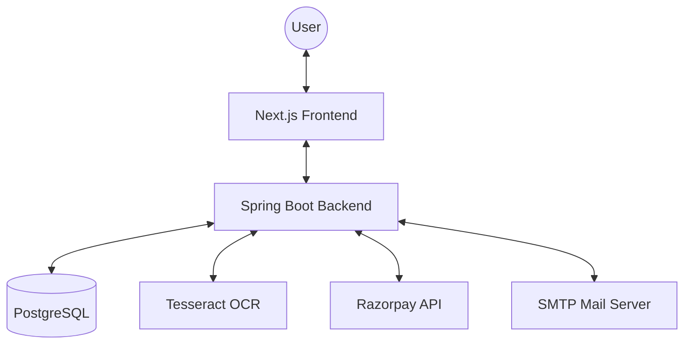

# Money Audit - Project Architecture

This document provides a comprehensive overview of the **Money Audit** (Finance Tracker + Splitwise Clone) architecture. It serves as a guide for developers to understand the system's structure, technologies, and patterns.

---

## 🏗️ System Overview
Money Audit is a full-stack financial management application that allows users to track personal expenses, manage budgets, process receipts via OCR, and split bills with friends/groups using Razorpay for settlements.

### High-Level Architecture

---

## 🛠️ Technology Stack

### Backend (this repository)
- **Framework**: Spring Boot 3.5.10
- **Language**: Java 21 (LTS)
- **Security**: Spring Security + JWT (jjwt)
- **Data Access**: Spring Data JPA + Hibernate
- **Database**: PostgreSQL 15
- **Build Tool**: Maven
- **Documentation**: Springdoc OpenAPI (Swagger UI)

### Frontend (sibling repository: `money-audit-frontend`)
- **Framework**: Next.js
- **Language**: TypeScript
- **Styling**: Tailwind CSS / Shadcn UI (inferred)

### DevOps & Tools
- **Containerization**: Docker (PostgreSQL)
- **OCR Engine**: Tesseract (Tess4J)
- **Payment Gateway**: Razorpay

---

## 📂 Backend Project Structure

The backend follows a **Feature-Based Modular Structure**, which promotes scalability and clear domain separation.

### Core Directory Structure
`src/main/java/com/Pranav/finance_tracker/`

| Package | Responsibility |
| :--- | :--- |
| `auth/` | JWT Authentication, Security configuration, Login/Register logic. |
| `user/` | User profile management and account details. |
| `expense/` | **Personal** expense tracking (Private spending). |
| `category/` | Expense/Budget categories. |
| `group/` | **Group Management & Splitting**: Shared groups, Group expenses, and balances. |
| `receipt/` | OCR processing of receipt images using Tesseract. |
| `payment/` | Razorpay integration and settlement tracking. |
| `budget/` | Budget planning and tracking. |
| `savings/` | Savings goals and progress. |
| `analytics/` | Dashboard summaries and insights. |
| `friend/` | **Friend Management & 1-on-1 Splitting**: Friendship requests and direct bill splitting. |
| `email/` | SMTP services for notifications and summaries. |
| `config/` | Global Spring configurations (CORS, Swagger, etc.). |
| `exception/` | Global error handling and custom exceptions. |

### Feature Internal Layout
Each feature package typically contains:
- `controller/`: REST API endpoints.
- `service/`: Business logic.
- `repository/`: Database interactions (JPA).
- `entity/`: Database models.
- `dto/`: Data Transfer Objects for API requests/responses.

---

## 🗄️ Database Schema Overview

The system uses PostgreSQL with the following primary entities:

- **User**: Core identity.
- **Expense**: Individual spending records.
- **Group**: Containers for shared expenses.
- **GroupMember**: Junction table for Users in Groups.
- **GroupExpense**: Expenses belonging to a group.
- **GroupExpenseSplit**: Individual shares within a group expense.
- **Receipt**: OCR metadata and storage references.
- **Payment**: Transaction records for bill settlements.
- **Budget**: Financial limits set per category.
- **Saving**: Targeted savings goals.
- **Friendship**: Peer-to-peer relationships.

---

## ⚙️ Key Integrations

### 1. OCR (Receipt Processing)
- **Tool**: Tesseract OCR via Tess4J.
- **Workflow**: Users upload images -> Tesseract extracts text -> Backend parses amounts/items -> Expense is pre-filled.
- **Config**: Defined in `application.yaml` under `ocr.tesseract`.

### 2. Payments (Razorpay)
- **Tool**: Razorpay Java SDK.
- **Workflow**: Settlements generate a payment link/order -> Razorpay handles the transaction -> Backend verifies webhook/signature.

### 3. Authentication
- **Method**: Stateless JWT.
- **Secret**: Managed via `application.yaml` (should be environment variable in production).
- **Expiration**: Default 24 hours.

---

## 🚀 Getting Started

### Prerequisites
- JDK 21
- Docker Desktop
- Maven

### Local Setup
1. **Database**: Run `docker compose up -d` to start PostgreSQL.
2. **Configuration**: Update `src/main/resources/application.yaml` with your credentials (Razorpay, SMTP).
3. **Run**: Use `./mvnw spring-boot:run`.
4. **API Docs**: Access `http://localhost:8080/swagger-ui.html`.

---

## 📝 Design Principles
1. **Clean Code**: Use of Lombok for boilerplate reduction.
2. **Scalability**: Feature-based packaging allows adding new modules without cluttering.
3. **Resilience**: Global exception handling ensures consistent API error responses.
4. **Asynchronous Processing**: Enabled via `@EnableAsync` for non-blocking operations like email sending.
5. **Scheduled Tasks**: Enabled via `@EnableScheduling` for periodic jobs (e.g., weekly summaries).
6. **Security**: Role-based access control for API endpoints.
