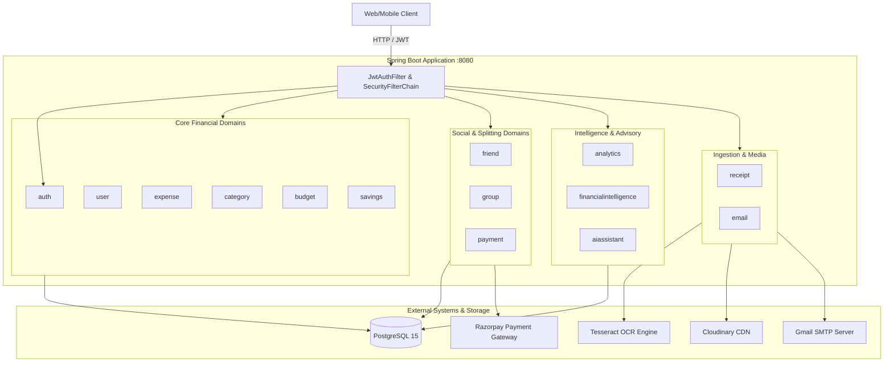

# 03 — Project Knowledge Graph

## Purpose
A living relational model and topological map capturing the components, data flows, trust boundaries, and interdependencies within `money-audit`.

## Scope
Cross-layer system topology: Controller -> Service -> Repository -> Database / External APIs.

## Current Status
- **Baseline Topology**: Initialized from high-level package analysis.
- **Deep Relationship Traces**: Pending Level 2 & Level 3.

---

## 1. High-Level System Graph [OBSERVED]

---

## 2. Interaction Matrix [Placeholder]

| Source Component | Target Component | Protocol / Mechanism | Data Exchanged | Verified? |
| :--- | :--- | :--- | :--- | :--- |
| `aiassistant` | `FinancialToolRegistry` | In-memory Java Call | Tool request/response | ⏳ Pending Level 4 |
| `group` | `payment` | Spring Service Call | Settlement status | ⏳ Pending Level 5 |
| `receipt` | `ocr` | JNI / Local File | Image file / Raw text | ⏳ Pending Level 5 |

---

## 3. Trust Boundaries [Placeholder]
- [ ] *Boundary 1: External Client to Public Endpoints (`/api/auth/**`).*
- [ ] *Boundary 2: Authenticated Client to Protected Endpoints (JWT Claims verification).*
- [ ] *Boundary 3: Backend to External APIs (Razorpay webhooks, Cloudinary).*
